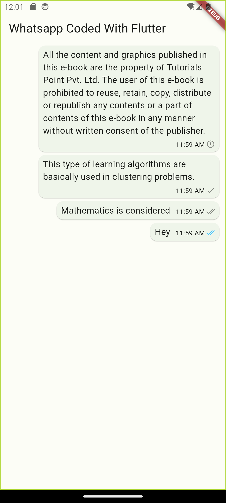
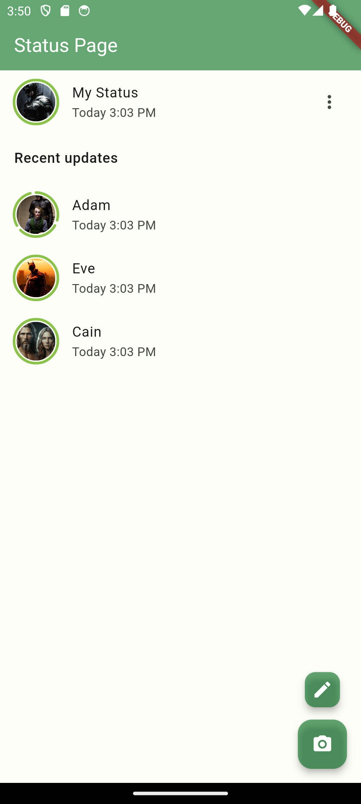
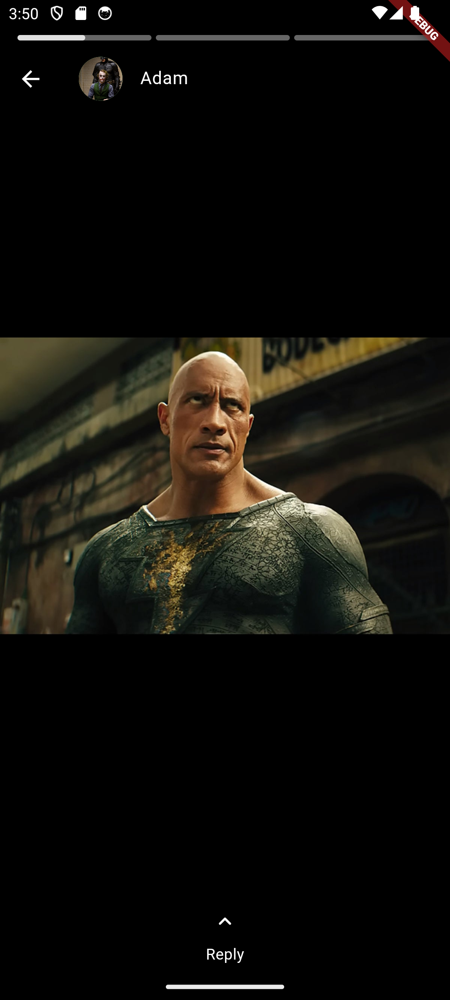
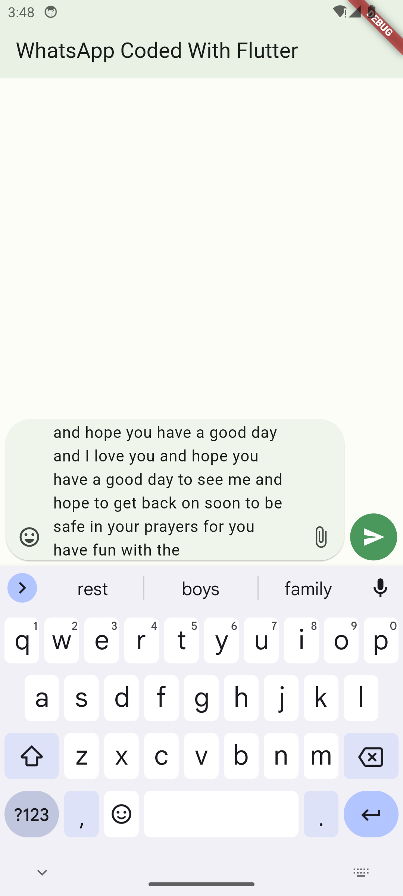
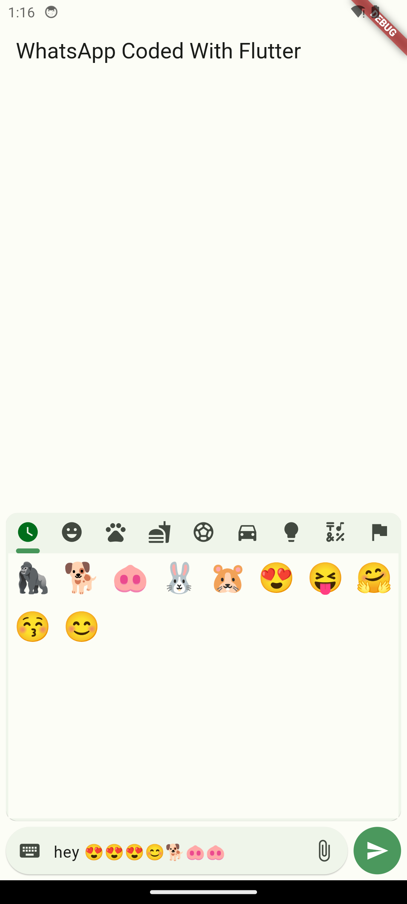

# whatsapp_coded_with_flutter

[Link to YouTube Playlist](https://www.youtube.com/playlist?list=PLh4DuGxrPvWhVaXxPqrwvUOz7BynkWu8P)

## Chat Bubble

## Status

## Chat Input Widget

## Emoji Picker

